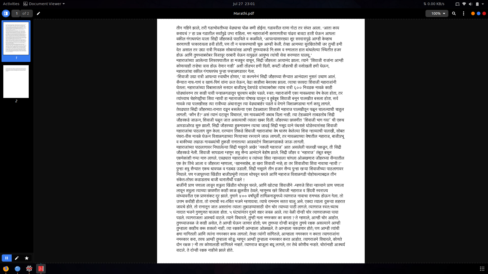
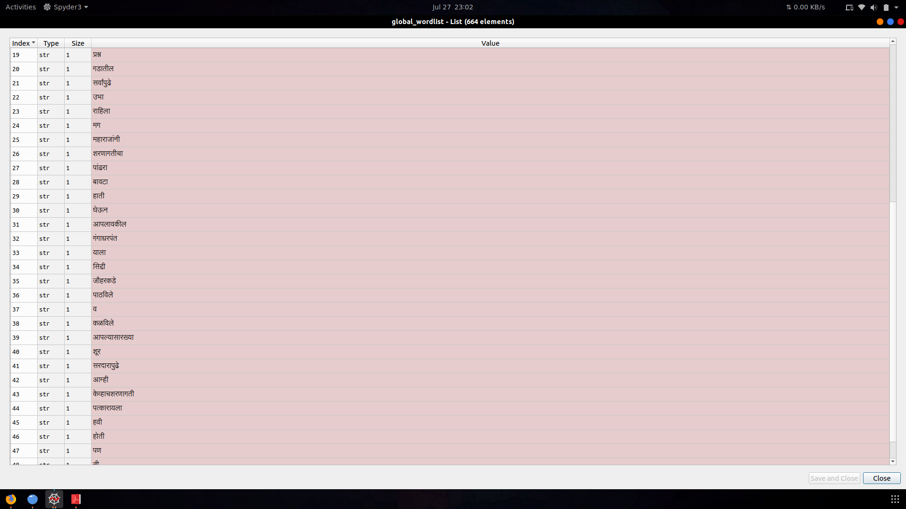
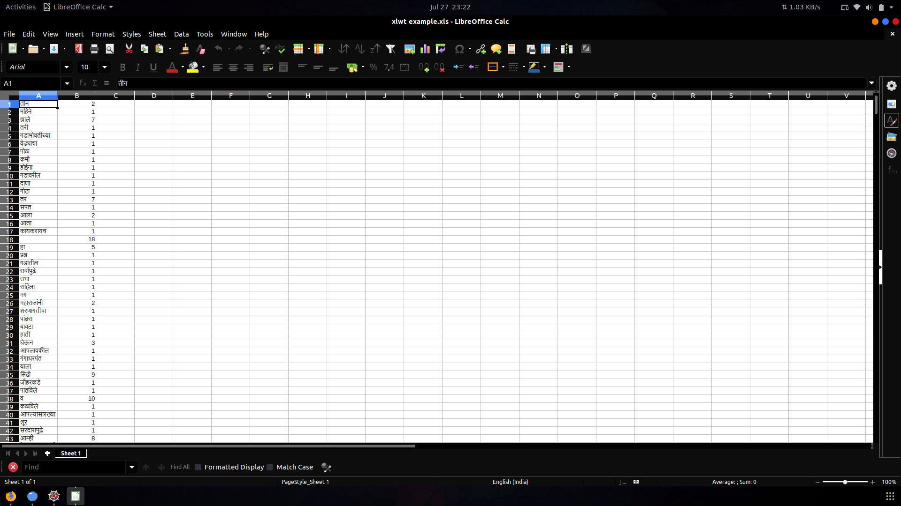

# Text_words_extractor
- Python3 tool to Extract Marathi words from PDF and Write them down in XLS sheet along with Frequency 
- Although the tool is designed to work on Marathi language, It is compatiable with English/Hindi/Devnagiri 

## Prerequisites
  - Python3
  - pdftotext
  - regex
  - xlwt
  
## Description

- This tool iterates from all the available pages of selected pdf and saves each word from the text in a seprate cell XLS file system.
- This tool also keeps track of Frequency of each word and saves it along with the word itself. 
 
## Screenshots

- 
- 
- 
